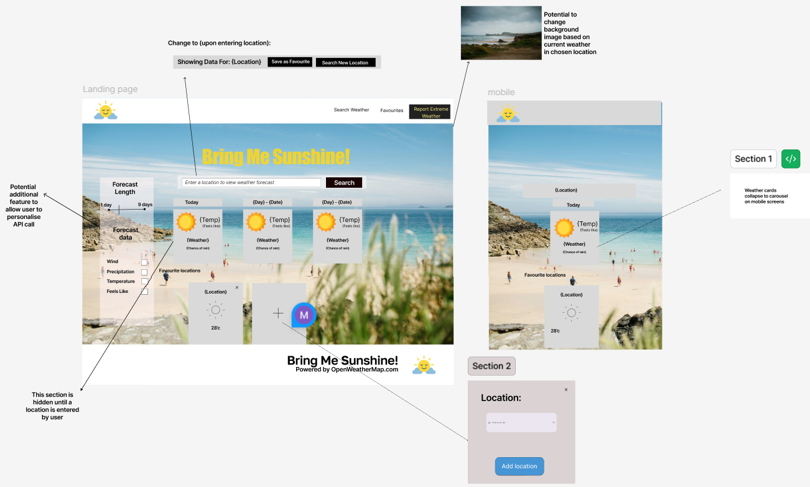

# Weather App - Django Fullstack Project

A modern, responsive weather application built with Django, Bootstrap 5, and real-time AJAX functionality.

## 🌤️ Features

- **User Authentication**: Email-verified registration and login with django-allauth
- **Weather Search**: Real-time weather search with autocomplete suggestions
- **Favorite Locations**: Save and manage favorite locations for quick access
- **User Profiles**: Customizable profiles with Cloudinary image upload
- **AJAX Real-time Updates**: No page reloads for weather searches and favorites management
- **Responsive Design**: Bootstrap 5 with custom vanilla CSS
- **Admin Interface**: Full Django admin for managing users, locations, and API usage
- **API Integration**: OpenWeather API for accurate weather data
- **Cloud Storage**: Cloudinary integration for profile pictures
- **Production Ready**: Heroku deployment configuration included

## 🏗️ Tech Stack

- **Backend**: Django 4.2.11
- **Database**: PostgreSQL
- **Frontend**: Bootstrap 5, Vanilla CSS, Vanilla JavaScript (AJAX)
- **Authentication**: django-allauth with email verification
- **Forms**: django-crispy-forms
- **Media Storage**: Cloudinary
- **Server**: Gunicorn + WhiteNoise
- **Deployment**: Heroku

## 📋 Project Structure

```
Weather-App/
├── weatherproject/          # Main Django project
│   ├── settings.py         # Project settings
│   ├── urls.py             # URL configuration
│   └── wsgi.py             # WSGI config
├── weather/                # Weather app
│   ├── models.py           # Location, WeatherLog models
│   ├── views.py            # Weather views and AJAX endpoints
│   ├── services.py         # OpenWeather API service
│   └── urls.py             # App URLs
├── favorites/              # Favorites app
│   ├── models.py           # FavoriteLocation model
│   ├── views.py            # Favorites AJAX endpoints
│   ├── urls.py             # App URLs
│   └── admin.py            # Admin customization
├── users/                  # Users app
│   ├── models.py           # UserProfile model
│   ├── signals.py          # User profile creation signal
│   └── admin.py            # Admin customization
├── templates/              # HTML templates
│   ├── base.html           # Base template
│   ├── weather/home.html   # Dashboard
│   └── favorites/list.html # Favorites page
├── static/
│   ├── css/styles.css      # Custom styles
│   └── js/
│       ├── navbar.js       # Navbar functionality
│       └── script.js       # Main weather functionality
├── env.py                  # Environment variables (local)
├── requirements.txt        # Python dependencies
├── Procfile               # Heroku configuration
├── DEPLOYMENT.md          # Deployment guide
└── manage.py              # Django management
```

## 🚀 Quick Start

### Local Development

1. **Clone and setup**:

```bash
git clone <repo>
cd Weather-App
python -m venv venv
source venv/bin/activate  # On Windows: venv\Scripts\activate
pip install -r requirements.txt
```

2. **Configure environment**:

```bash
cp .env.example .env
# Edit .env with your API keys
```

3. **Initialize database**:

```bash
python manage.py migrate
python manage.py createsuperuser
```

4. **Run development server**:

```bash
python manage.py runserver
```

5. **Access application**:

- App: http://localhost:8000
- Admin: http://localhost:8000/admin
- Accounts: http://localhost:8000/accounts/login

### Environment Variables

Create a `.env` file with:

- `SECRET_KEY`: Django secret key
- `DEBUG`: Set to False for production
- `OPENWEATHER_API_KEY`: From openweathermap.org
- `CLOUDINARY_CLOUD_NAME`, `CLOUDINARY_API_KEY`, `CLOUDINARY_API_SECRET`: From cloudinary.com
- `EMAIL_HOST_USER`, `EMAIL_HOST_PASSWORD`: Gmail app password
- `DATABASE_URL`: PostgreSQL connection string (Heroku)

See `.env.example` for complete list.

## 🔑 API Endpoints

### Weather API

- `GET /` - Home page with weather search
- `POST /api/weather/` - Get weather for coordinates
- `POST /api/search/` - Search locations

### Favorites API

- `GET /favorites/` - View all favorites
- `POST /favorites/api/add/` - Add location to favorites
- `DELETE /favorites/api/remove/<id>/` - Remove favorite
- `GET /favorites/api/get-all/` - Get all favorites (JSON)

### Authentication (allauth)

- `GET /accounts/signup/` - Register
- `GET /accounts/login/` - Login
- `GET /accounts/logout/` - Logout
- `GET /accounts/email/` - Email settings/profile

## 🎨 Customization

### Styling

- Main styles: `static/css/styles.css`
- Uses Bootstrap 5 + custom vanilla CSS
- Gradient theme with purple/pink colors

### Weather Icons

- Font Awesome icons mapped to OpenWeather codes
- Edit `weatherIcons` object in `static/js/script.js`

### Email Templates

- Create `templates/account/` for allauth custom emails

## 🛡️ Security Features

- CSRF protection on all forms
- Secure password hashing
- Email verification for new accounts
- SSL/TLS in production
- Secure cookies in production
- Content Security Policy headers
- XSS protection

## 📦 Dependencies

See `requirements.txt` for full list:

- Django 4.2.11
- djangorestframework
- django-allauth (authentication)
- django-crispy-forms + crispy-bootstrap5
- cloudinary (media storage)
- psycopg2-binary (PostgreSQL)
- gunicorn (production server)
- whitenoise (static file serving)
- dj-database-url (heroku database)

## 🚢 Deployment

See [DEPLOYMENT.md](DEPLOYMENT.md) for detailed Heroku deployment steps.

Quick summary:

```bash
heroku create your-app-name
heroku addons:create heroku-postgresql:hobby-dev
heroku config:set OPENWEATHER_API_KEY=xxx ...
git push heroku main
heroku run python manage.py migrate
```

## 🐛 Troubleshooting

### "No API key configured"

- Set `OPENWEATHER_API_KEY` in environment variables
- Go to https://openweathermap.org to get free key

### "Location not found"

- OpenWeather has limited city database
- Try different spelling or search by country code

### Email not sending

- Enable Gmail "Less secure apps" or use App Password
- Check logs: `heroku logs --tail`

### Static files not loading

- Run: `python manage.py collectstatic`
- Check: `STATIC_ROOT` and `STATICFILES_DIRS` in settings

## 📚 Documentation

- [Django Docs](https://docs.djangoproject.com/)
- [django-allauth](https://django-allauth.readthedocs.io/)
- [OpenWeather API](https://openweathermap.org/api)
- [Cloudinary Docs](https://cloudinary.com/documentation)
- [Bootstrap 5](https://getbootstrap.com/docs/5.0/)

## 📄 License

MIT License - feel free to use for your own projects

## 👨‍💻 Contributing

Contributions welcome! Please:

1. Fork the repository
2. Create a feature branch
3. Make your changes
4. Submit a pull request

## 🤝 Support

For issues or questions:

- Check existing issues
- Create new issue with details
- Email support or open discussion

---

**Happy weather tracking! 🌦️**

Our wireframes reflect the intented features to fill our user stories:


## Functionality

Javascript interactivity is found in five main elements of the website:


1. Searchbar to update location
   Default when page loads to the users current geolocation or London
2. Change Current Weather Display
   Shows weather summary for default location or when search is applied
3. Filters and Forecast Duration
   User can select which data points are shown and for how many days to a maximum of 7
4. Forecast Section
   Shows weather forecast for next 5 days by default, but can be altered based on user’s selection
5. Favourites Section
   Add saved locations underneath main forecast area


## Meeting Intended Learning Outcomes

LO1: Learners will be able to design and implement a one-page interactive Front-End web application using HTML, CSS, and JavaScript focusing on user experience design, accessibility, and responsive DOM manipulation.

LO2: Learners will be able to test and validate a one-page web application through development, implementation, and deployment stages.

LO3: Learners will be able to deploy a one-page web application to a Cloud platform ensuring functionality and security.

LO4: Learners will be able to maximize future maintainability through thorough documentation, clear code structure, and organization.

LO5: Learners will be able to implement and document front-end interactivity using core JavaScript, JavaScript libraries, or frameworks with a focus on DOM manipulation for a one-page web application.

LO6: Learners will be able to leverage AI tools to orchestrate the software development process.

## Testing

Lighthouse Testing and Code Validation Tests Completed


 Minor warnings given, due to importing fonts


Warning given regarding trailing slashes and use of H5 in footer, now corrected.

## Deployment and workflow

Project displayed in project board with each task assigned to member, given labels of urgency and updated regularly.


This project is deployed through github pages and follows a simplified agile gitflow methodology:

- Each day of the project being considered one 'sprint'.
- Main branch is preserved as the deployed and live branch, whilst all development work will be conducted on feature branches.
- Code deployments to the live project environment will only available through a pull request to main. This enables a CI/CD approach.
- All feautures must be tested on the 'develop' branch before being considered a release candidate to main.
  This ensures the deployed project maintains a stable codebase, and provides a scaleable workflow should the project scope increase and more developers were required to join the project.

Example of gitflow:


## Use of AI in development and project retrospective.

Ai used to create initial boilerplate from wireframe, streamlining bootstrap structuring. Due to fairly complex wireframe, this did have superfluous css classes that needed removed.

Use of AI for generation of repetitive code and resolving functional bugs.

## Use of external resources

https://unsplash.com/ - For hero image assets

No other external code was used in this project.
